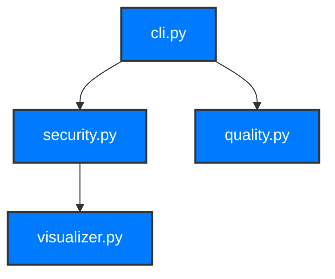

# MCP Code Analyzer - Distribution Guide

This guide covers how to build, test, and distribute the MCP Code Analyzer Python package.

## 📦 Package Distribution

### Prerequisites

1. **Python 3.9+** installed
2. **Build tools** installed:
   ```bash
   pip install build wheel twine
   ```
3. **Development dependencies** installed:
   ```bash
   pip install -r requirements-dev.txt
   ```

### Building the Package

#### Option 1: Using the Build Script (Recommended)

```bash
# Run the automated build script
python build_package.py
```

This script will:
- Clean previous build artifacts
- Check dependencies
- Run tests
- Build the package
- Validate the package
- Show package information

#### Option 2: Manual Build

```bash
# Clean previous builds
rm -rf build/ dist/ *.egg-info/

# Build using modern Python packaging
python -m build

# Or build using setup.py (legacy)
python setup.py sdist bdist_wheel
```

### Package Structure

The built package includes:

```
mcp-code-analyzer-1.0.0/
├── mcp_code_analyzer.egg-info/
├── dist/
│   ├── mcp_code_analyzer-1.0.0.tar.gz          # Source distribution
│   └── mcp_code_analyzer-1.0.0-py3-none-any.whl # Wheel distribution
└── build/
    ├── bdist.linux-x86_64/
    └── lib/
        └── src/
            └── [package contents]
```

### Testing the Package

#### Local Installation Test

```bash
# Install the built package locally
pip install dist/mcp_code_analyzer-1.0.0-py3-none-any.whl

# Test the CLI
mcp-code-analyzer --help

# Test basic functionality
mcp-code-analyzer analyze-project . --format console
```

#### Uninstall Test Package

```bash
pip uninstall mcp-code-analyzer
```

### Package Validation

#### Check Package Quality

```bash
# Validate package with twine
twine check dist/*

# Check for common issues
python -m build --sdist --wheel
```

#### Test on Different Python Versions

```bash
# Using tox (if configured)
tox

# Or manually test on different Python versions
python3.9 -m pip install dist/mcp_code_analyzer-1.0.0-py3-none-any.whl
python3.10 -m pip install dist/mcp_code_analyzer-1.0.0-py3-none-any.whl
python3.11 -m pip install dist/mcp_code_analyzer-1.0.0-py3-none-any.whl
```

## 🚀 Publishing to PyPI

### Test PyPI (Recommended First)

```bash
# Upload to Test PyPI
python -m twine upload --repository testpypi dist/*

# Test installation from Test PyPI
pip install --index-url https://test.pypi.org/simple/ mcp-code-analyzer
```

### Production PyPI

```bash
# Upload to production PyPI
python -m twine upload dist/*
```

### GitHub Releases

```bash
# Create a GitHub release with the built packages
# 1. Go to GitHub repository
# 2. Click "Releases" → "Create a new release"
# 3. Upload the files from dist/ directory
# 4. Add release notes
```

## 📋 Package Contents

### Core Features Included

- ✅ **Security Analysis**: Vulnerability detection, dependency scanning
- ✅ **Quality Analysis**: Code quality metrics, dead code detection
- ✅ **Complexity Analysis**: Cyclomatic complexity, maintainability index
- ✅ **Dependency Analysis**: Dependency mapping, circular dependency detection
- ✅ **GitHub Integration**: Repository analysis, security scanning
- ✅ **Visualization**: Dependency graphs, complexity heatmaps
- ✅ **Reporting**: HTML, Markdown, JSON exports
- ✅ **CI/CD Integration**: Quality gates, badge generation
- ✅ **CLI Interface**: Full command-line interface

### Entry Points

```bash
# Main CLI command
mcp-code-analyzer

# Alternative command
mcp-analyzer
```

### Available Commands

```bash
# Project analysis
mcp-code-analyzer analyze-project <path>

# Dependency analysis with visualization
mcp-code-analyzer dependencies <path> --visualize --format mermaid

# GitHub repository analysis
mcp-code-analyzer analyze-github <url>

# Report generation
mcp-code-analyzer generate-report <path> --format html

# Quality gates
mcp-code-analyzer quality-gate <path>

# Badge generation
mcp-code-analyzer generate-badge <path> --metric security_score

# History and trends
mcp-code-analyzer show-history
mcp-code-analyzer show-trends
```

## 🔧 Configuration

### Package Configuration

The package supports configuration via:

1. **Command-line options**: Direct CLI parameters
2. **Configuration files**: JSON configuration files
3. **Environment variables**: For sensitive data like API keys

### Example Configuration

```json
{
  "analysis": {
    "include_patterns": ["src/**/*.py", "tests/**/*.py"],
    "exclude_patterns": ["**/__pycache__/**", "**/*.pyc"],
    "max_complexity": 15,
    "security_rules": ["all"]
  },
  "quality_gates": {
    "critical_issues": 0,
    "high_issues": 5,
    "overall_health_score": 80
  },
  "ci": {
    "fail_on_critical": true,
    "comment_on_pr": true
  }
}
```

## 📊 Dependency Graph Generation

### Yes, we generate dependency graphs!

The package includes comprehensive dependency graph generation:

#### Supported Formats

1. **Mermaid**: For documentation and GitHub
   ```bash
   mcp-code-analyzer dependencies . --format mermaid --export-graph deps.mmd
   ```

2. **Graphviz**: For advanced visualization
   ```bash
   mcp-code-analyzer dependencies . --format graphviz --export-graph deps.dot
   ```

3. **D3.js**: For interactive web visualizations
   ```bash
   mcp-code-analyzer dependencies . --format d3 --export-graph deps.json
   ```

4. **ASCII**: For console output
   ```bash
   mcp-code-analyzer dependencies . --visualize --format text
   ```

#### Graph Features

- **Node Types**: Internal, external, standard library
- **Edge Types**: Import, from-import, dynamic
- **Metrics**: In-degree, out-degree, coupling
- **Patterns**: Circular dependencies, god modules, hub modules
- **Visualization**: Color coding, size scaling, layout options

#### Example Output



## 🧪 Testing

### Running Tests

```bash
# Run all tests
pytest

# Run with coverage
pytest --cov=src --cov-report=html

# Run specific test categories
pytest tests/test_analyzers/ -v
pytest tests/test_integration/ -v
```

### Test Coverage

The package includes comprehensive tests for:
- Unit tests for all analyzers
- Integration tests for CLI commands
- Test fixtures and sample projects
- Mock data for consistent testing

## 📈 Version Management

### Version Bumping

```bash
# Update version in setup.py and pyproject.toml
# Then rebuild package
python build_package.py
```

### Changelog

Maintain a `CHANGELOG.md` file with:
- Version numbers
- Release dates
- New features
- Bug fixes
- Breaking changes

## 🔒 Security Considerations

### Package Security

- ✅ **No hardcoded secrets** in the package
- ✅ **Dependency scanning** for vulnerabilities
- ✅ **Secure defaults** for all configurations
- ✅ **Input validation** for all user inputs

### Distribution Security

- ✅ **Signed packages** (when possible)
- ✅ **Checksum verification**
- ✅ **Secure upload** to PyPI
- ✅ **Vulnerability scanning** of dependencies

## 📚 Documentation

### Included Documentation

- ✅ **README.md**: Comprehensive user guide
- ✅ **API.md**: API documentation
- ✅ **CI-CD.md**: CI/CD integration guide
- ✅ **DISTRIBUTION.md**: This distribution guide

### Documentation Generation

```bash
# Generate API documentation
sphinx-apidoc -o docs/api src/

# Build documentation
cd docs && make html
```

## 🚀 Deployment

### CI/CD Integration

The package includes GitHub Actions workflows for:
- Automated testing
- Package building
- PyPI deployment
- Release management

### Docker Support

```dockerfile
FROM python:3.9-slim

WORKDIR /app
COPY dist/mcp_code_analyzer-*.whl .
RUN pip install mcp_code_analyzer-*.whl

ENTRYPOINT ["mcp-code-analyzer"]
```

## 📞 Support

### Getting Help

- **Issues**: GitHub Issues
- **Documentation**: README.md and docs/
- **Examples**: examples/ directory
- **Tests**: tests/ directory

### Contributing

1. Fork the repository
2. Create a feature branch
3. Make changes
4. Add tests
5. Submit a pull request

## 🎯 Next Steps

After building and testing the package:

1. **Test locally** with different Python versions
2. **Upload to Test PyPI** for validation
3. **Test installation** from Test PyPI
4. **Upload to production PyPI**
5. **Create GitHub release**
6. **Update documentation**
7. **Announce release**

---

**Happy distributing! 🚀** 